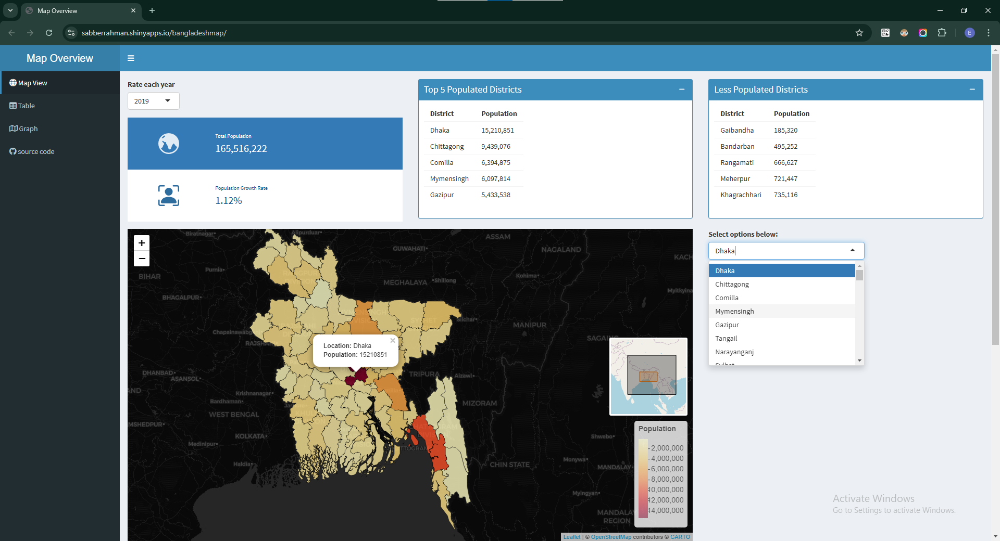

## shiny dashboard using `R` [visit ↗ ](https://sabberrahman.shinyapps.io/bangladeshmap/)

## ☕ stack used 
 main:  `R` , `Rstudio` , `Leaflet`   
 packages : `shiny Dashboard`, Bslib, `Plotly`, DT 